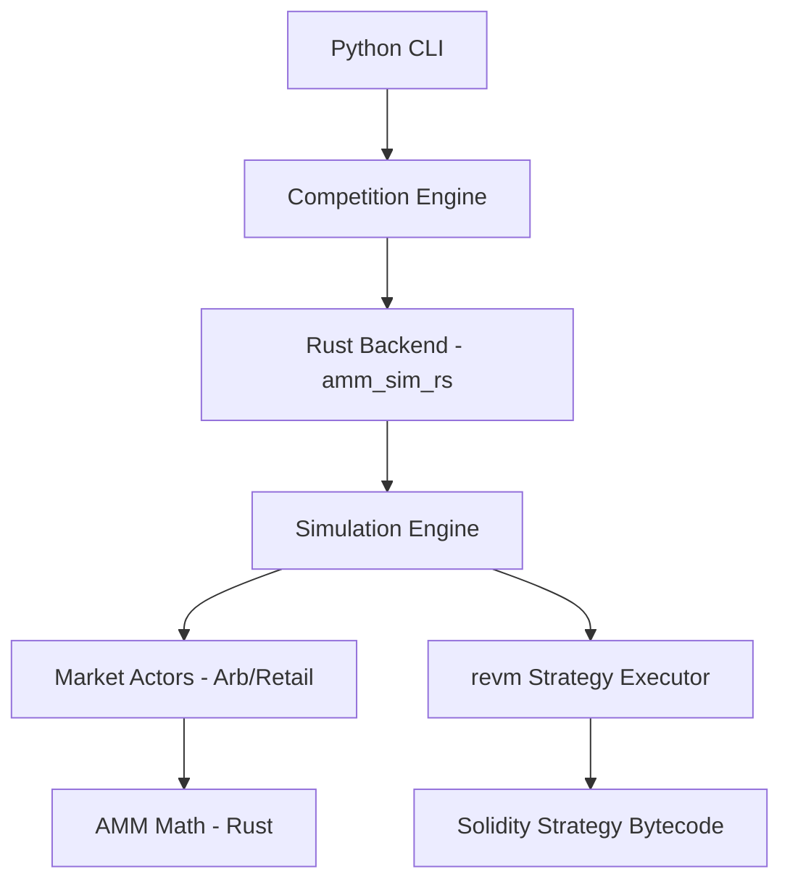

# Architecture

The AMM Challenge system is designed for high-performance simulation of EVM-based trading strategies.

## System Flow

## Component Roles

- **Python CLI**: Configures the competition parameters and launches the process.
- **Competition Engine**: Handles strategy compilation (Solidity -> Bytecode) and result aggregation.
- **Rust Backend**: Provides a Python module that wraps the high-performance simulation logic.
- **Simulation Engine**: The central coordinator for time-stepping and actor interactions.
- **Market Actors**: Simulate realistic market pressure on the AMM.
- **revm Executor**: A fast, in-memory EVM that executes the fee-determination logic of the strategies.
- **AMM Math**: High-precision fixed-point math implementing the constant product invariant and fee collection.
